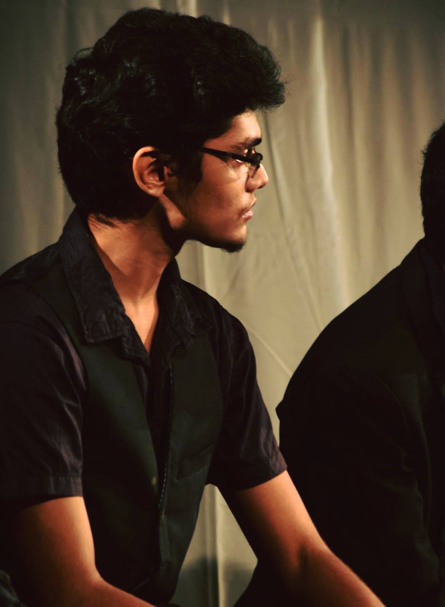
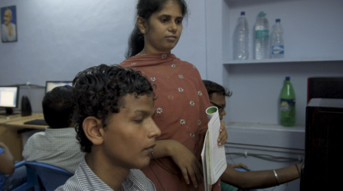

<!-- -->
## Bayern Munchen Hackathon - Improving fan experiences
I was chosen from 1,300 applicants around the world to take part in a hackathon conducted by FC Bayern Munich and Technical University Munich. There, we designed a Computer Vision system that capture people's emotions as they watched football matches, and combined it with corresponding footage from the match, thus creating personalised match highlights for each person. 

## Organiser - Hackathon for the Visually Impaired
{: .right width="300" height="150"}
I launched India’s first python programming online course for visually impaired people. We took content from MIT's OpenCourseWare, and taught Python programming to 32 blind students over 4 months. We also organized a Hackathon for the Visually Impaired at the end of the course – India’s first programming contest for visually impaired people. The event was done in collaboration with the central government's Accessible India campaign.