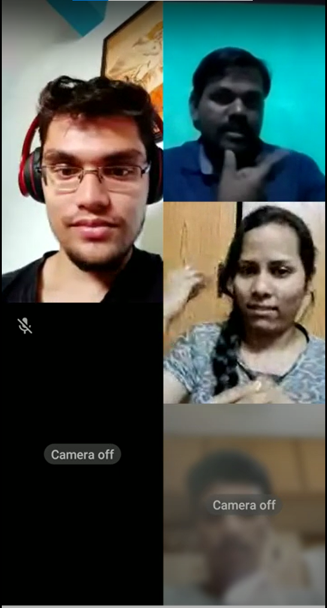

{width="150" height="200"}
<!--- _Screenshot from one of our interviews_ -->

We conducted a HCI (human-computer Interaction) study with the Indian Deaf population. The study consisted of 15 45-minute interviews with Deaf participants, and circulated a form that got 132 responses from employed members of the Deaf community. Through the above, we ascertain the various challenges faced by them on a day-to-day basis, and evaluate the current state of technology, as well as how accessible technology can be built for them. You can read a pre-print version of the paper here. The paper will be submitted to CSCW 2022. 

